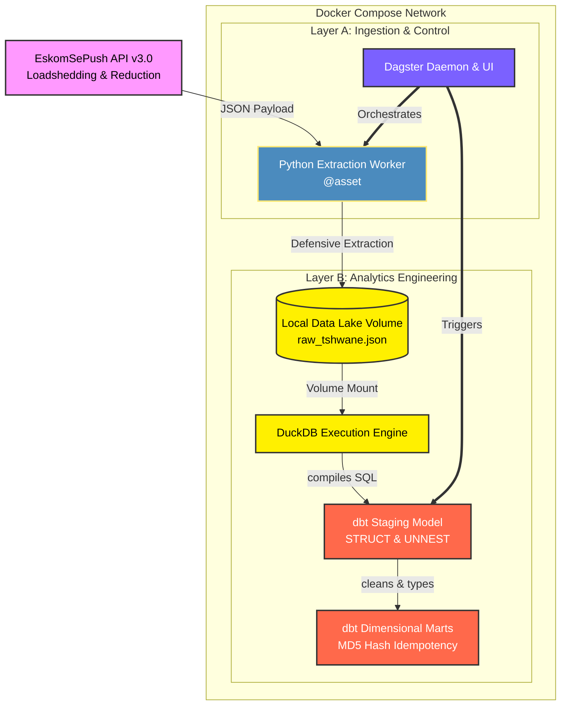

# Eskom Grid Observability System: Batch ELT Pipeline

## 1. Context & Business Value
South Africa's energy grid experiences volatile power outages, evolving from national loadshedding to localized load reduction. Downstream analytical dashboards require a reliable, structured, and historically accurate dimensional model of these schedules to provide observability into grid stability. 

This project is a production-grade, containerized ELT (Extract, Load, Transform) pipeline. It extracts live outage data (loadshedding and load reduction) from the EskomSePush API, enforces strict data contracts to survive schema drift, and models the JSON payloads into a Kimball dimensional architecture using DuckDB and dbt, fully orchestrated via Dagster inside a Dockerized environment.

## 2. Architecture & Tech Stack
The system is built on a "Modern Data Stack in a Box" architecture, containerized for local development and parity with production environments.

* **Containerization & Orchestration:** Docker & Docker Compose
* **Control Plane / Orchestrator:** Dagster (Daemon + Webserver architecture)
* **Extraction Engine:** Python (`requests`, `python-dotenv`)
* **Storage & Compute Engine:** DuckDB (v1.10.1)
* **Transformation Layer:** dbt CLI (v1.11.11+) with `dbt-duckdb` adapter

### System Flow


## 3. Core Engineering Problems Solved

### A. Containerized Environment Isolation
**The Problem:** "It works on my machine" issues due to differing local Python versions, OS-specific dependencies, or missing environment variables.
**The Solution:** The entire pipeline—including the Dagster orchestrator, the dbt run environment, and the local storage volumes—is wrapped in a multi-container Docker Compose file. This guarantees identical execution whether run on WSL 2, macOS, or an enterprise cloud platform.

### B. Surviving Schema Drift (The Data Contract)
**The Problem:** When grid outages or load reductions are suspended, the upstream API optimizes its payload by omitting the `events` array entirely, crashing standard auto-inferring ingestion scripts.
**The Solution:** 1. **Python Layer:** The extraction worker intercepts the payload and forcibly injects an empty `events` array (`[]`) and a custom `_meta` wrapper before writing to disk.
2. **DuckDB Layer:** The staging layer utilizes explicit `STRUCT` mapping to strictly define the expected layout in memory, allowing `UNNEST()` functions to safely yield zero rows instead of triggering fatal database crashes.

### C. Mathematical Idempotency
**The Problem:** Running a batch pipeline multiple times a day risks duplicating transactional outage events in the database.
**The Solution:** Engineered a deterministic primary key (`event_id`) in the Kimball Marts layer using `MD5(area_id || start_time::VARCHAR || loadshedding_stage::VARCHAR)`. This hash guarantees that consecutive pipeline runs mathematically overwrite or ignore duplicate records, maintaining absolute data consistency.

## 4. Scalability Roadmap
Because the local environment is completely containerized, scaling horizontally is a configuration change rather than a code rewrite:
* **V1 (Current):** Docker Compose (Local Python, local JSON, DuckDB, Dagster Daemon).
* **V2 (Cloud Batch):** Docker images migrated to AWS ECR -> Tasks execution on AWS ECS / Kubernetes -> DuckDB storage replaced by Snowflake / BigQuery.
* **V3 (Event-Driven):** Apache Kafka (Ingestion Stream) -> Apache Flink (Transform) -> ClickHouse (Real-Time OLAP).

## 5. Local Setup & Execution

### Prerequisites
* Docker & Docker Compose
* A valid EskomSePush API Key (v3.0)

### Quickstart

1. **Clone the Repository:**
```bash
git clone [text](https://github.com/Furnx/eskom-grid-observability)
cd eskom-grid-observability
2. **Install Dependencies:**pip install -r requirements.txt

```

2. **Configure Environment Variables:**
Create a `.env` file in the root directory:
```env
ESKOM_API_KEY="your_api_key_here"
```

3. **Spin Up the Containerized Stack:**
```bash
docker compose up --build -d
```
This command builds your localized workspace container, spins up the Dagster engine, mounts the local data lake volumes, and runs the setup completely detached.

4. **Access the Control Plane:**
Navigate to `http://localhost:3000` to access the Dagster UI, map your software-defined asset graph, and launch the end-to-end pipeline run.