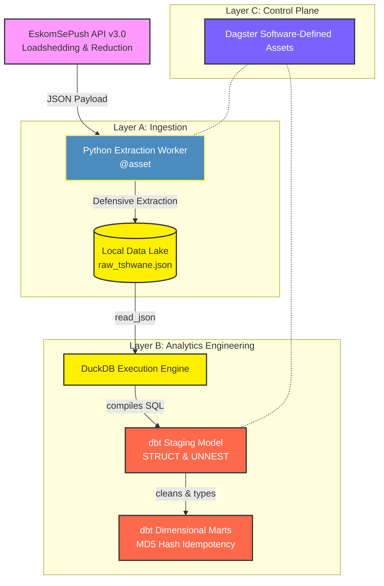

# Eskom Grid Observability System: Batch ELT Pipeline

## 1. Context & Business Value
South Africa's energy grid experiences volatile power outages, evolving from national loadshedding to localized load reduction. Downstream analytical dashboards require a reliable, structured, and historically accurate dimensional model of these schedules to provide observability into grid stability. 

This project is a production-grade, local-first ELT (Extract, Load, Transform) pipeline. It extracts live outage data (loadshedding and load reduction) from the EskomSePush API, enforces strict data contracts to survive schema drift, and models the JSON payloads into a Kimball dimensional architecture using DuckDB and dbt.

## 2. Architecture & Tech Stack
The system is built on a "Modern Data Stack in a Box" architecture, heavily emphasizing defensive programming and in-place orchestration.

* **Extraction:** Python (`requests`, `python-dotenv`)
* **Storage & Compute Engine:** DuckDB (v1.10.1)
* **Transformation:** dbt CLI (v1.11.11+) with `dbt-duckdb` adapter
* **Orchestration:** Dagster (Software-Defined Assets)

### System Flow


## 3. Core Engineering Problems Solved

### A. Surviving Schema Drift (The Data Contract)
**The Problem:** When grid outages are suspended, the upstream API optimizes its payload by omitting the `events` array entirely. Standard ingestion engines crash when auto-inferring schemas on missing arrays.
**The Solution:** 1. **Python Layer:** The extraction worker intercepts the payload and forcibly injects an empty `events` array (`[]`) and a custom `_meta` wrapper (Area ID/Name) before writing to disk.
2. **DuckDB Layer:** Bypassed `read_json_auto()` inference. The dbt staging model uses strict `STRUCT` mapping to explicitly define the schema in memory, allowing `UNNEST()` functions to process empty arrays safely, yielding zero rows instead of fatal crashes.

### B. Mathematical Idempotency
**The Problem:** Running a batch pipeline multiple times a day risks duplicating transactional outage events in the database.
**The Solution:** Engineered a deterministic primary key (`event_id`) in the Kimball Marts layer using `MD5(area_id || start_time::VARCHAR || loadshedding_stage::VARCHAR)`. This hash guarantees that consecutive pipeline runs mathematically overwrite or ignore duplicate records, maintaining absolute idempotency.

### C. Native Orchestration Integration
**The Problem:** Traditional orchestration relies on brittle, standalone wrapper scripts to trigger Python files and dbt commands.
**The Solution:** Utilized Dagster's Software-Defined Assets (SDAs). The Python extraction logic is decorated in-place with `@asset`, and the dbt transformation layer is linked via `@dbt_assets` reading the `manifest.json`. The pipeline is inherently data-aware without technical debt.

## 4. Scalability Roadmap
While currently designed for local execution (WSL 2 memory capped), the architecture is decoupled to allow seamless enterprise scaling:
* **V1 (Current):** Local Python -> Local JSON -> DuckDB -> Dagster Daemon.
* **V2 (Cloud Batch):** Dockerized Python Workers (AWS ECS) -> Amazon S3 (Data Lake) -> Snowflake (Compute) -> dbt Cloud.
* **V3 (Event-Driven):** Apache Kafka (Ingestion Stream) -> Apache Flink (Transform) -> ClickHouse (Real-Time OLAP).

## 5. Local Setup & Execution

### Prerequisites
* Python 3.10+
* DuckDB v1.10.1
* A valid EskomSePush API Key (v3.0)

### Quickstart

1. **Clone & Environment:**
```bash
git clone https://github.com/Furnx/eskom-grid-observability.git
cd eskom-grid-observability
python -m venv venv
.\venv\Scripts\activate.bat
pip install -r requirements.txt
```

2. **Configure Credentials:**
Create a `.env` file in the root directory:
```env
ESKOM_API_KEY="your_api_key_here"
DAGSTER_HOME="./.dagster"
```

3. **Boot Orchestrator:**
```bash
dagster dev
```
Navigate to `http://localhost:3000` to view the asset graph and materialize the pipeline.