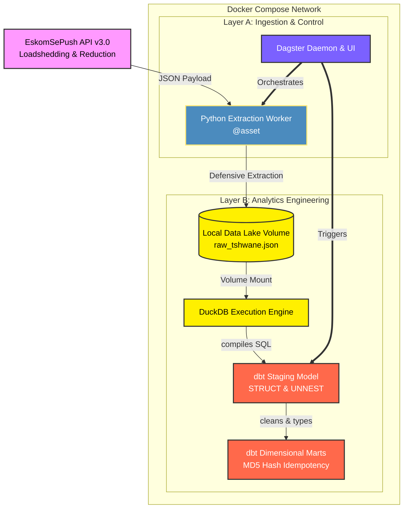

# Eskom Grid Observability System: Batch ELT Pipeline

## 1. Context & Business Value

### The Gap EskomSePush Doesn't Fill

EskomSePush solves **real-time alerting** — it tells you *what* is happening right now. It does not solve **historical analysis**. No structured, queryable record of *when* outages occurred, *how long* they lasted, or *what stage* they reached exists in a form that BI tools, data analysts, or cross-domain data pipelines can consume.

This means any business or analytics team that needs to answer operational questions is left with no usable data source:

| Question | EskomSePush | This Pipeline |
|---|---|---|
| How many hours of outages occurred in Q2? | ❌ | ✅ `fct_loadshedding_events.duration_hours` |
| What was the worst outage stage last month? | ❌ | ✅ Queryable `loadshedding_stage` fact |
| Which months had the most clustering of Stage 6? | ❌ | ✅ Historical time-series in dimensional model |
| Join outage data with our ops/financial data? | ❌ | ✅ Kimball model designed for cross-domain joins |

### What This Pipeline Builds

This project is the **data infrastructure layer** that EskomSePush's app would need to power an analytics dashboard — the part they don't expose. It is a production-grade, containerized ELT (Extract, Load, Transform) pipeline that:

1. **Extracts** live outage data from the EskomSePush API on a scheduled cadence
2. **Enforces a strict data contract** to survive the API's own schema instability
3. **Models** the raw JSON payloads into a Kimball dimensional architecture — a permanent, idempotent, schema-stable fact table of every outage event — queryable by any BI tool

---

## 2. Architecture & Tech Stack

The system is built on a "Modern Data Stack in a Box" architecture, containerized for local development and parity with production environments.

* **Containerization & Orchestration:** Docker & Docker Compose
* **Control Plane / Orchestrator:** Dagster (Daemon + Webserver architecture)
* **Extraction Engine:** Python (`requests`, `python-dotenv`)
* **Storage & Compute Engine:** DuckDB (v1.10.1)
* **Transformation Layer:** dbt CLI (v1.11.11+) with `dbt-duckdb` adapter

### System Flow

```mermaid
graph TD
    %% Define Styles
    classDef api fill:#f9f,stroke:#333,stroke-width:2px,color:#000;
    classDef python fill:#4B8BBE,stroke:#FFE873,stroke-width:2px,color:#fff;
    classDef duckdb fill:#FFF000,stroke:#333,stroke-width:2px,color:#000;
    classDef dbt fill:#FF694B,stroke:#333,stroke-width:2px,color:#fff;
    classDef dagster fill:#7b61ff,stroke:#333,stroke-width:2px,color:#fff;
    classDef docker fill:#2496ED,stroke:#333,stroke-width:2px,color:#fff;

    %% Nodes
    A[EskomSePush API v3.0<br/>Loadshedding & Reduction]:::api
    
    subgraph Docker Compose Network
        direction TB
        
        subgraph Layer A: Ingestion & Control
            Z[Dagster Daemon & UI]:::dagster
            B[Python Extraction Worker<br/>@asset]:::python
        end

        subgraph Layer B: Analytics Engineering
            C[(Local Data Lake Volume<br/>raw_tshwane.json)]:::duckdb
            D[DuckDB Execution Engine]:::duckdb
            E[dbt Staging Model<br/>STRUCT & UNNEST]:::dbt
            F[dbt Dimensional Marts<br/>MD5 Hash Idempotency]:::dbt
        end
    end

    %% Edges
    A -->|JSON Payload| B
    B -->|Defensive Extraction| C
    C -->|Volume Mount| D
    D -->|compiles SQL| E
    E -->|cleans & types| F
    
    %% Control lines
    Z ==>|Orchestrates| B
    Z ==>|Triggers| E
```

---

## 3. Core Engineering Problems Solved

### A. Containerized Environment Isolation
**The Problem:** "It works on my machine" issues due to differing local Python versions, OS-specific dependencies, or missing environment variables.  
**The Solution:** The entire pipeline—including the Dagster orchestrator, the dbt run environment, and the local storage volumes—is wrapped in a multi-container Docker Compose file. This guarantees identical execution whether run on WSL 2, macOS, or an enterprise cloud platform.

### B. Surviving Schema Drift (The Data Contract)
**The Problem:** When grid outages or load reductions are suspended, the upstream API optimizes its payload by omitting the `events` array entirely, crashing standard auto-inferring ingestion scripts.  
**The Solution:**
1. **Python Layer:** The extraction worker intercepts the payload and forcibly injects an empty `events` array (`[]`) and a custom `_meta` wrapper before writing to disk.
2. **DuckDB Layer:** The staging layer utilizes explicit `STRUCT` mapping to strictly define the expected layout in memory, allowing `UNNEST()` functions to safely yield zero rows instead of triggering fatal database crashes.

### C. Mathematical Idempotency
**The Problem:** Running a batch pipeline multiple times a day risks duplicating transactional outage events in the database.  
**The Solution:** Engineered a deterministic primary key (`event_id`) in the Kimball Marts layer using `MD5(area_id || start_time::VARCHAR || loadshedding_stage::VARCHAR)`. This hash guarantees that consecutive pipeline runs mathematically overwrite or ignore duplicate records, maintaining absolute data consistency.

---

## 4. Scalability Roadmap
Because the local environment is completely containerized, scaling horizontally is a configuration change rather than a code rewrite:
* **V1 (Current):** Docker Compose (Local Python, local JSON, DuckDB, Dagster Daemon).
* **V2 (Cloud Batch):** Docker images migrated to AWS ECR → Tasks execution on AWS ECS / Kubernetes → DuckDB storage replaced by Snowflake / BigQuery.
* **V3 (Event-Driven):** Apache Kafka (Ingestion Stream) → Apache Flink (Transform) → ClickHouse (Real-Time OLAP).

---

## 5. Local Setup & Execution

### Prerequisites
* Docker & Docker Compose
* A valid EskomSePush API Key (v3.0)

### Quickstart

1. **Clone the Repository:**
```bash
git clone https://github.com/Furnx/eskom-grid-observability
cd eskom-grid-observability
```

2. **Configure Environment Variables:**  
   Create a `.env` file in the root directory:
```env
ESKOM_API_KEY="your_api_key_here"
```

3. **Spin Up the Containerized Stack:**
```bash
docker compose up --build -d
```
This command builds your localized workspace container, spins up the Dagster engine, mounts the local data lake volumes, and runs the setup completely detached.

4. **Access the Control Plane:**  
   Navigate to `http://localhost:3000` to access the Dagster UI, map your software-defined asset graph, and launch the end-to-end pipeline run.